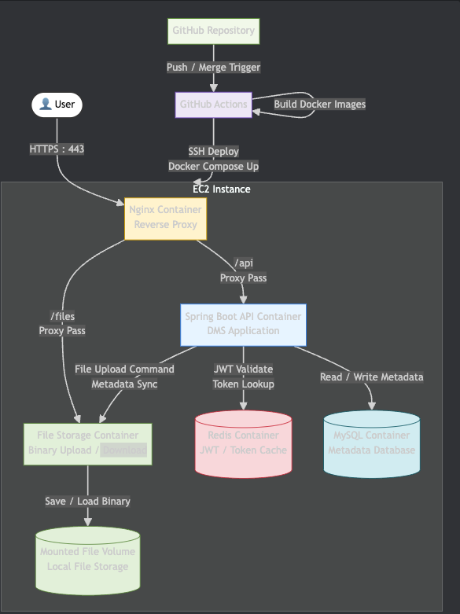

# Tiny Drive

내 손안의 작은 드라이브, Tiny Drive 입니다.

Tiny Drive는 Google Drive 스타일의 클라우드 기반 DMS(Document Management System)를 목표로 하는 프로젝트입니다.

단순 파일 저장소를 넘어,
대용량 파일 업로드, 문서 관리, 권한 관리, 비동기 처리, 확장 가능한 인프라 구조를 학습하고 설계하는 것을 목표로 합니다.

---

## Features

- JWT 기반 인증
- 파일 업로드 / 다운로드
- 폴더 기반 문서 관리
- 파일 메타데이터 관리
- Redis 기반 JWT 토큰 관리
- Nginx Reverse Proxy 기반 라우팅
- Docker Container 기반 서비스 분리
- GitHub Actions 기반 CI/CD 자동화

---

## Tech Stack

### Backend

- Java 21
- Spring Boot 3.x
- Spring Security
- JPA (Hibernate)
- MySQL
- Redis
- Docker
- Nginx

### Infrastructure

- EC2
- GitHub Actions
- Docker Compose

---

## Architecture

### MVP Architecture

---

## Docs

- [MVP Architecture](docs/infra/infra-mvp.md)
- [API Spec](docs/api/openapi.yaml)
- [ERD](docs/erd/erd-mvp.md)
- [ADR](docs/adr)

---

## Future Goals

- AWS S3 기반 파일 스토리지 확장
- Presigned URL 기반 업로드
- 이벤트 기반 파일 처리 구조
- 썸네일 비동기 생성
- CQRS 기반 조회 최적화
- Read Replica 분리
- CloudFront CDN 도입

---

## Why Tiny Drive?

본 프로젝트는 단순 CRUD 구현보다,
실제 문서 관리 시스템에서 발생할 수 있는 문제들을 고민하고 해결하는 과정에 집중합니다.

특히 다음과 같은 주제를 학습하고자 합니다.

- 확장 가능한 아키텍처 설계
- 무상태 인증(JWT)
- 파일 업로드 전략
- Reverse Proxy 및 배포 구조
- Docker 기반 운영 환경
- DDD 기반 설계
- 이벤트 기반 아키텍처