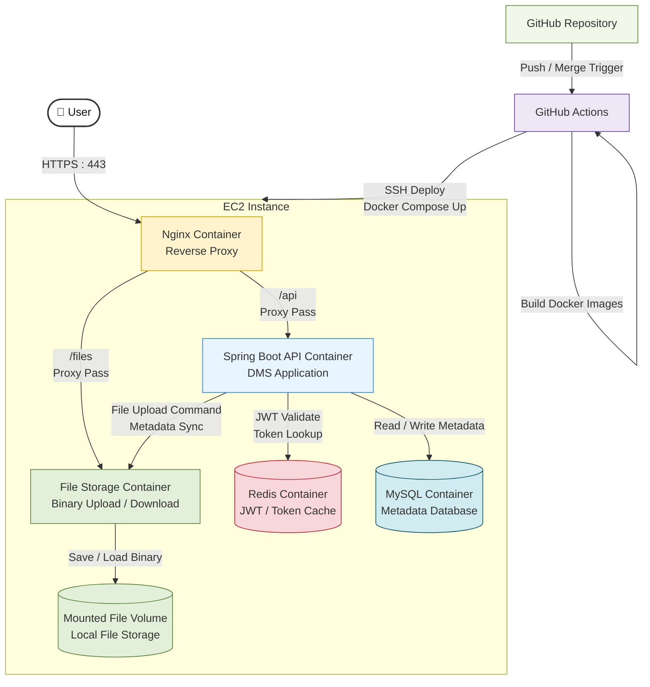

# 프로젝트 아키텍처 (MVP)
### 사용자 흐름도

```mermaid

flowchart TB

%% =========================
%% Actors & CI/CD
%% =========================
    User([👤 User])

GitHub["GitHub Repository"]

Actions["GitHub Actions"]

%% =========================
%% EC2 Server
%% =========================
subgraph EC2["EC2 Instance"]

%% =========================
%% Reverse Proxy
%% =========================
Nginx["Nginx Container<br/>Reverse Proxy"]

%% =========================
%% Application Layer
%% =========================
SpringBoot["Spring Boot API Container<br/>DMS Application"]

%% =========================
%% File Storage Layer
%% =========================
FileStorage["File Storage Container<br/>Binary Upload / Download"]

FileVolume[("Mounted File Volume<br/>Local File Storage")]

%% =========================
%% Cache Layer
%% =========================
Redis[("Redis Container<br/>JWT / Token Cache")]

%% =========================
%% Database Layer
%% =========================
MySQL[("MySQL Container<br/>Metadata Database")]

end

%% =========================
%% User Request Flow
%% =========================
User -->|HTTPS : 443| Nginx

%% =========================
%% Reverse Proxy Routing
%% =========================
Nginx -->|/api<br/>Proxy Pass| SpringBoot

Nginx -->|/files<br/>Proxy Pass| FileStorage

%% =========================
%% Application Dependencies
%% =========================
SpringBoot -->|JWT Validate<br/>Token Lookup| Redis

SpringBoot -->|Read / Write Metadata| MySQL

SpringBoot -->|File Upload Command<br/>Metadata Sync| FileStorage

%% =========================
%% File Binary Storage
%% =========================
FileStorage -->|Save / Load Binary| FileVolume

%% =========================
%% CI/CD Pipeline
%% =========================
GitHub -->|Push / Merge Trigger| Actions

Actions -->|Build Docker Images| Actions

Actions -->|SSH Deploy<br/>Docker Compose Up| EC2

%% =========================
%% Style Definitions
%% =========================
classDef actor fill:#ffffff,stroke:#333,stroke-width:2px,color:#111;

classDef source fill:#f1f8e9,stroke:#558b2f,stroke-width:1px;

classDef cicd fill:#ede7f6,stroke:#673ab7,stroke-width:1px;

classDef proxy fill:#fff3cd,stroke:#d39e00,stroke-width:1px;

classDef app fill:#e8f4ff,stroke:#2f80ed,stroke-width:1px;

classDef storage fill:#e2f0d9,stroke:#548235,stroke-width:1px;

classDef cache fill:#f8d7da,stroke:#c82333,stroke-width:1px;

classDef db fill:#d1ecf1,stroke:#0c5460,stroke-width:1px;

%% =========================
%% Apply Styles
%% =========================
class User actor;

class GitHub source;

class Actions cicd;

class Nginx proxy;

class SpringBoot app;

class FileStorage,FileVolume storage;

class Redis cache;

class MySQL db;

```